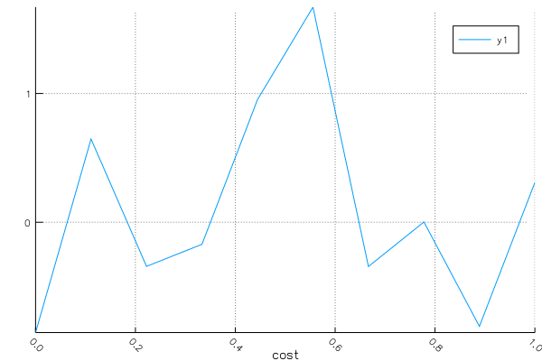
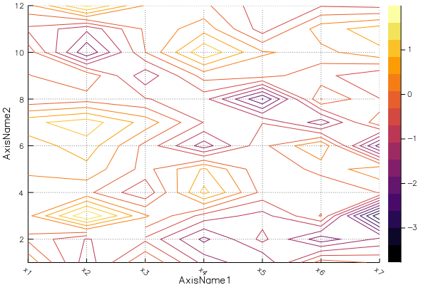
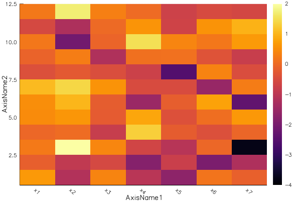

# AxisArrayPlots

## Usage

```Julia
using AxisArrays, Plots, AxisArrayPlots
arr1 = AxisArray(randn(10), Axis{:cost}(linspace(0,1,10)))
arr2 = AxisArray(randn(7,12), Axis{:AxisName1}(["x$i" for i in 1:7]), Axis{:AxisName2}(1:12))
display(plot(arr1))
display(plot(arr2))
display(heatmap(arr2))
```



